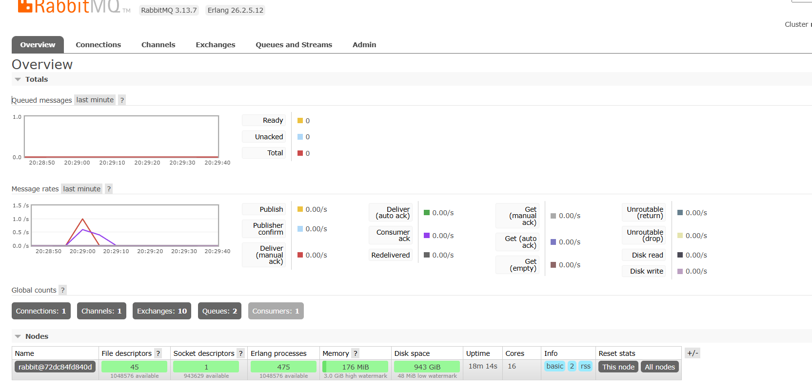
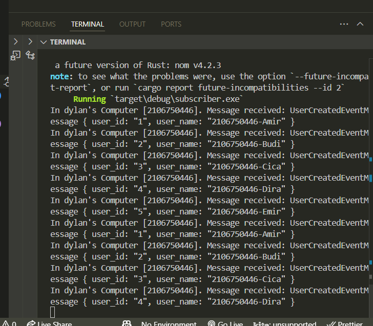
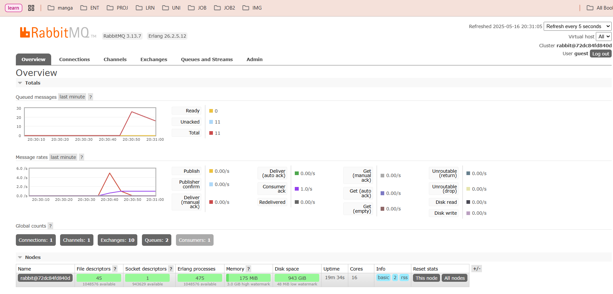

1. What is amqp?

    amqp is a protocol for message-oriented middleware. It is used to send messages between different applications or services in a reliable and efficient manner. in this case, i am using amqp to connect to rabbitmq via the crosstownbus library

2. What does it mean? guest:guest@localhost:5672 , what is the first guest, and what
is the second guest, and what is localhost:5672 is for?

    first guest is the username to connect to rabbitmq, and the second one is the password. localhost:5672 is the address of the rabbitmq server.

## Reflection on Running Multiple Subscribers

When running multiple subscribers, I noticed that the message queue spike was reduced more quickly compared to when running just a single subscriber. This behavior occurs because:

1. **Parallel Processing**: With multiple subscribers, messages are distributed among them, allowing for concurrent processing. Each subscriber handles a portion of the messages, leading to faster overall processing.

2. **Load Distribution**: RabbitMQ distributes messages in a round-robin fashion among multiple consumers of the same queue. This distributes the processing load evenly.

3. **Increased Throughput**: The collective processing power of multiple subscribers increases the system's overall throughput, allowing the queue to be drained faster during high message volume periods.
